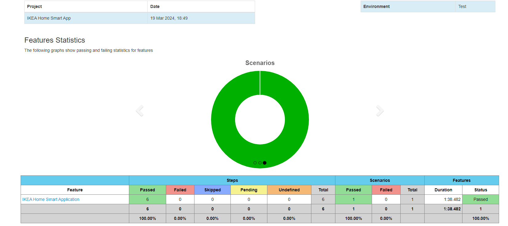

# About the Framework
Automation framework is a set of guidelines,or rules used to create and design automated test scripts.
This automation framework provide a generic solutions to test applications on real Android devices on :
1. Saucelab
2. Local (not tested)

# Automation Framework Implementations:
1. Sequential testing (Real devices and Emulator) - Saucelab
2. Application used: [IKEA_Home_smart.apk](src%2Ftest%2Fresources%2Fapp%2FIKEA_Home_smart.apk)
3. HTML Cucumber report after tests execution.
4. Cucumber Hooks
5. PageFactory - page objects
6. BDD Cucumber to write feature file
7. DriverFactory - all drivers (Android)
8. Utilities - Test utilities
9. Profile - to configure the environment details
10. build.gradle - required dependencies

## Tool Stacks
1) Springboot
2) Gradle
3) Java
4) Junit
5) Appium
6) Saucelab

### How to Run the Test
1) TestRunner class
2) By Using gradle cmd:
   gradle clean build -Dcucumber="@TC01_Smartapp" -Denv=dev

### Cucumber HTML Report
